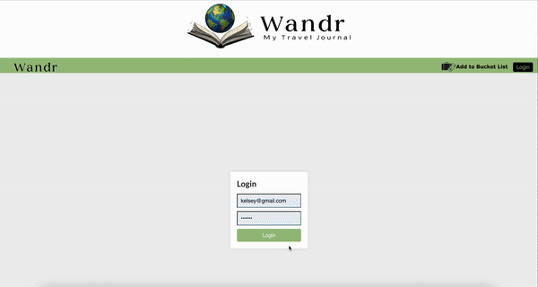

Wandr: Virtual Travel Diary

A React-based application designed to document your travels, build itineraries for bucket list destinations, leave reviews and photos, and track visited places.

Table of Contents

	•	Features
	•	Technologies Used
	•	Setup Instructions
	•	Usage
	•	Future Enhancements
	•	Contributors
	•	License

Features

	•	User Authentication: Login and logout functionality.
	•	Travel Itineraries: Plan trips and save itineraries for destinations.
	•	Reviews: Add reviews to share your travel experiences.
	•	Activity Tracking: Associate activities with specific dates.
	•	Search and Filter: Locate trips using search and filter functionality.
	•	Photo Uploads: Add photos to trips.

Technologies Used

	•	Frontend: React, React Router, Styled Components
	•	State Management: React Hooks (useState, useEffect)
	•	Data Management: JSON for mock data handling
	•	Styling: Styled Components

Setup Instructions

Prerequisites

Ensure you have the following installed on your machine:
	•	Node.js
	•	npm or yarn

Installation

	1.	Clone the repository:

git clone <repository-url>  

	2.	Navigate to the project folder:

cd virtual-travel-diary  

	3.	Install dependencies:

npm install  

	4.	Start the development server:

npm start  

	5.	Access the app in your browser at http://localhost:3000.

Usage

	1.	Log in to the app.
	2.	Create a new trip or edit an existing one.
	3.	Add activities, dates, and reviews to your trips.
	4.	Search, filter, and explore planned and completed trips.

Future Enhancements

	•	Backend Integration: Connect to a real database for persistent data storage.
	•	Improved Authentication: Add password encryption and user management.
	•	Mobile Responsiveness: Optimize the app for mobile devices.
	•	Social Features: Allow users to share itineraries and reviews.

Contributors

	•	Jacqueline Trapp
    •	Kelsey Roche
    

License

This project is licensed under the MIT License.

Feel free to customize further based on your specific implementation and goals!